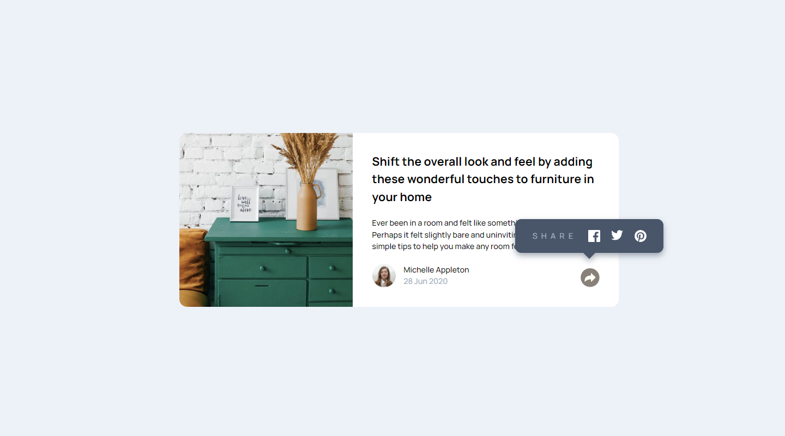
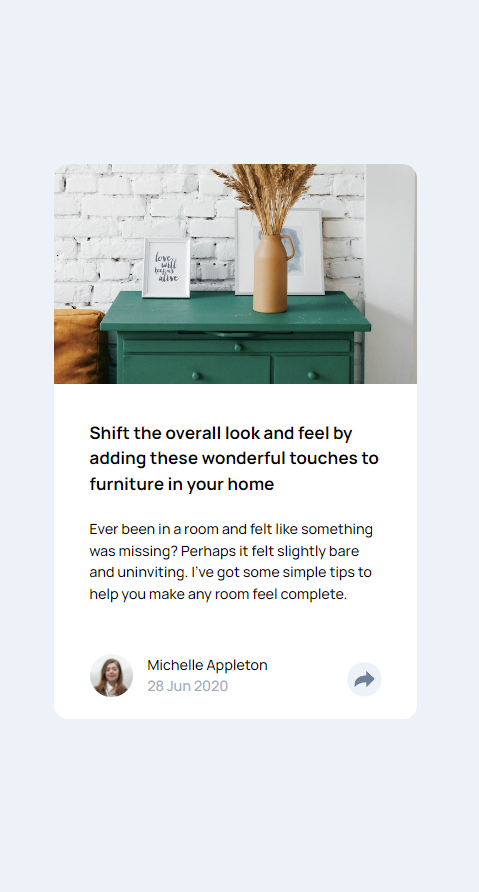

# Frontend Mentor - Article preview component solution

This is a solution to the [Article preview component challenge on Frontend Mentor](https://www.frontendmentor.io/challenges/article-preview-component-dYBN_pYFT). Frontend Mentor challenges help you improve your coding skills by building realistic projects. 

## Table of contents

- [Overview](#overview)
  - [The challenge](#the-challenge)
  - [Screenshot](#screenshot)
  - [Links](#links)
- [My process](#my-process)
  - [Built with](#built-with)
  - [What I learned](#what-i-learned)
  - [Continued development](#continued-development)
  - [Useful resources](#useful-resources)
- [Author](#author)
- [Acknowledgments](#acknowledgments)

**Note: Delete this note and update the table of contents based on what sections you keep.**

## Overview

### The challenge

Users should be able to:

- View the optimal layout for the component depending on their device's screen size
- See the social media share links when they click the share icon

### Screenshot

### Links

- Solution URL: [Solution URL here](https://github.com/kwngptrl/FEM-article-preview-component-master)
- Live Site URL: [Live site URL here](https://kwngptrl.github.io/FEM-article-preview-component-master/)

## My process

Laid out the HTML and CSS, then the JS. It was a bit tricky at first, since there are three conditions, not just two, that need to be met as the 'share arrow' icon is clicked on:
1. In mobile only, the 'share navbar' replaces the user and date info. Easy, toggle it on and off.
2. In desktop mode, the 'share navbar' hovers on top of the 'share arrow'. Easy, toggle it on and off.
3. If the 'share navbar' is open in desktop mode and the user narrows the window, the 'share navbar' must replace the user and date info. Not so easy, this depends on JS detecting the viewport size and acting according to 1 or 2.

I also found a hybrid way that would utilize two selectors in CSS and then JS for the rest, but I decided on having JS do it all.

When I got everything working, I started thinking that instead of a button I could use a checkbox/label thing just like in the 'Interactive rating component' challenge. Or, forego all of that and just use JS to detect clicks on the img element, although I don't think that is good practice.

### Built with

- Semantic HTML5 markup
- CSS custom properties
- Vanilla Javascript
- Flexbox
- CSS Grid
- Mobile-first workflow

### What I learned

Added my knowledge on event listeners. 
Learned a bit about making CSS tooltips. Including from here: [Border Triangles](https://css-tricks.com/books/greatest-css-tricks/how-to-make-a-triangle/)

### Continued development

As I was finishing up the challenge using some animation/transitions, I found out Kevin Powell's video: [Animate from display none](https://www.youtube.com/watch?v=4prVdA7_6u0). However I'll leave the code as is for now.

### Useful resources

- [Animate from display none](https://www.youtube.com/watch?v=4prVdA7_6u0) - Kevin Powell's tutorial on YouTube. Although I didn't apply it thoroughly, still is a good watch.
- [An Interactive Guide to JavaScript Events](hhttps://www.aleksandrhovhannisyan.com/blog/interactive-guide-to-javascript-events/) - Learned quite a bit here. I'd recommend it to anyone still learning this concept.
- [How to Capture Browser Window Resize Event in JavaScript](https://www.tutorialrepublic.com/faq/how-to-capture-browser-window-resize-event-in-javascript.php) - Applied what was presented here in the challenge, especially if the tooltip was enabled and the viewport was resized.
- [Detect clicks outside of an element](https://www.dom-tricks.com/click-outside) - Springboard into my learning about closing the tooltip by clicking outside of it.

## Author

- Frontend Mentor - [@Wannacode](https://www.frontendmentor.io/profile/kwngptrl)

## Acknowledgments

All credits also mentioned above.
